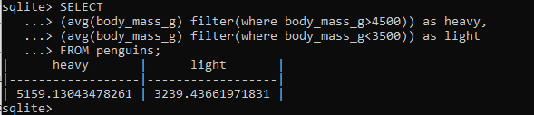
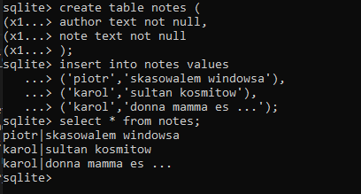
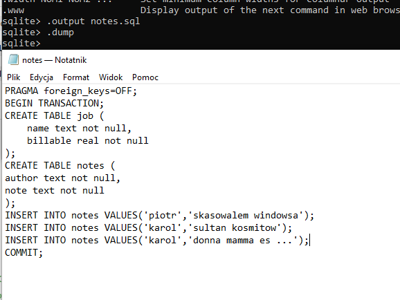
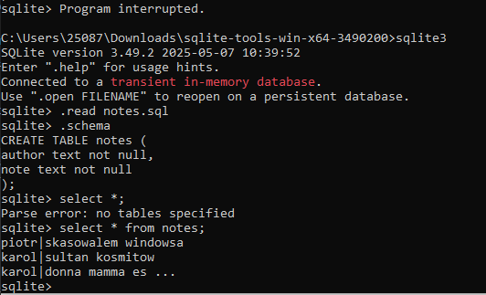
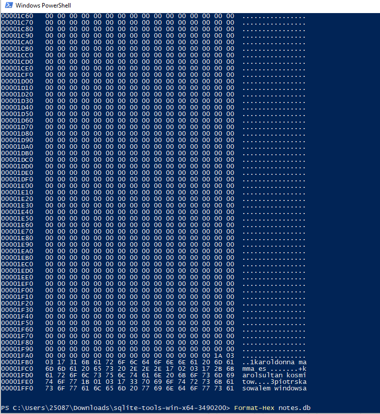
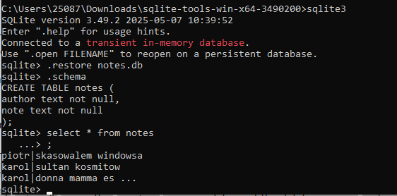
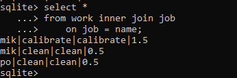
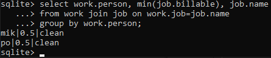

Zadanie 1
Write a SQL query to select the sex and body mass columns from the little_penguins in that order, sorted such that the largest body mass appears first.

```select 
    sex,body_mass_g 
FROM little_penguins 
order by body_mass_g desc
```


Zadanie 2
Write a SQL query to select the islands and species from rows 50 to 60 inclusive of the penguins table. Your result should have 11 rows.
```
select 
    island,species 
FROM penguins 
limit 10 OFFSET 50
```


Modify your query to select distinct combinations of island and species from the same rows and compare the result to what you got in part 1.
```
select DISTINCT
    island,species 
FROM penguins 
```


Zadanie 3
Write a query to select the body masses from penguins that are less than 3000.0 grams.
```
select body_mass_g from penguins WHERE body_mass_g<3000
```


Write another query to select the species and sex of penguins that weight less than 3000.0 grams. This shows that the columns displayed and those used in filtering are independent of each other.
```
select species,sex from penguins WHERE body_mass_g<3000
```


Zadanie 4
Use the not operator to select penguins that are not Gentoos.
```
select DISTINCT species from penguins WHERE species != 'Gentoo'
```


SQL's or is an inclusive or: it succeeds if either or both conditions are true. SQL does not provide a specific operator for exclusive or, which is true if either but not both conditions are true, but the same effect can be achieved using and, or, and not. Write a query to select penguins that are female or on Torgersen Island but not both.
```
select sex, island from penguins 
WHERE (sex = 'FEMALE' AND island != 'Torgersen')
   OR (island = 'Torgersen' AND sex != 'FEMALE');
```


Zadanie 5
A column called what_where that has the species and island of each penguin separated by a single space.
```
SELECT species|| ' ' || island AS what_where from penguins
```


A column called bill_ratio that has the ratio of bill length to bill depth.
```
SELECT bill_length_mm/bill_depth_mm AS bill_ratio from penguins
```


Zadanie 6
Write a query to find penguins whose body mass is known but whose sex is not.
```
SELECT body_mass_g,sex  from penguins 
where (sex is null) and (body_mass_g is not null)
```


Write another query to find penguins whose sex is known but whose body mass is not.
```
SELECT body_mass_g,sex  from penguins 
where (sex is not null) and (body_mass_g is null)
```


Zadanie 7
What is the average body mass of penguins that weight more than 3000.0 grams?

```
SELECT AVG(body_mass_g) AS average_mass
FROM penguins
WHERE body_mass_g > 3000.0;
```


Zadanie 8
Write a query that shows each distinct body mass in the penguin dataset and the number of penguins that weigh that much.
```
SELECT DISTINCT
 body_mass_g, count(body_mass_g) as number_of_penguins
FROM penguins
group by body_mass_g
```


Zadanie 9
```
Write a query that uses filter to calculate the average body masses of heavy penguins (those over 4500 grams) and light penguins (those under 3500 grams) simultaneously. Is it possible to do this using where instead of filter?
```


Zadanie 10
Using an in-memory database, define a table called notes with two text columns author and note and then add three or four rows. Use a query to check that the notes have been stored and that you can (for example) select by author name.


Zadanie 11
Saving and restoring data as text:

Re-create the notes table in an in-memory database and then use SQLite's .output and .dump commands to save the database to a file called notes.sql. Inspect the contents of this file: how has your data been stored?
```
.output notes.sql
.dump
```


Start a fresh SQLite session and load notes.sql using the .read command. Inspect the database using .schema and select *: is everything as you expected?


Saving and restoring data in binary format:

Re-create the notes table in an in-memory database once again and use SQLite's .backup command to save it to a file called notes.db. Inspect this file using od -c notes.db or a text editor that can handle binary data: how has your data been stored?


Start a fresh SQLite session and load notes.db using the .restore command. Inspect the database using .schema and select *: is everything as you expected?



Zadanie 12
Re-run the query shown above using where job = name instead of the full table.name notation. Is the shortened form easier or harder to read and more or less likely to cause errors?



Zadanie 13
Find the least time each person spent on any job. Your output should show that mik and po each spent 0.5 hours on some job. Can you find a way to show the name of the job as well using the SQL you have seen so far?

```
select work.person, min(job.billable), job.name
from work join job on work.job=job.name
group by work.person;
```

