Zadanie 1
Write a SQL query to select the sex and body mass columns from the little_penguins in that order, sorted such that the largest body mass appears first.

```select 
    sex,body_mass_g 
FROM little_penguins 
order by body_mass_g desc
```

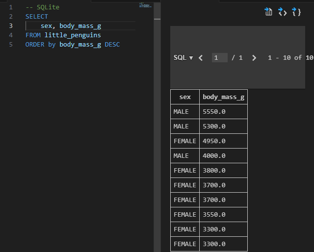


Zadanie 2
Write a SQL query to select the islands and species from rows 50 to 60 inclusive of the penguins table. Your result should have 11 rows.
```
select 
    island,species 
FROM penguins 
limit 10 OFFSET 50
```
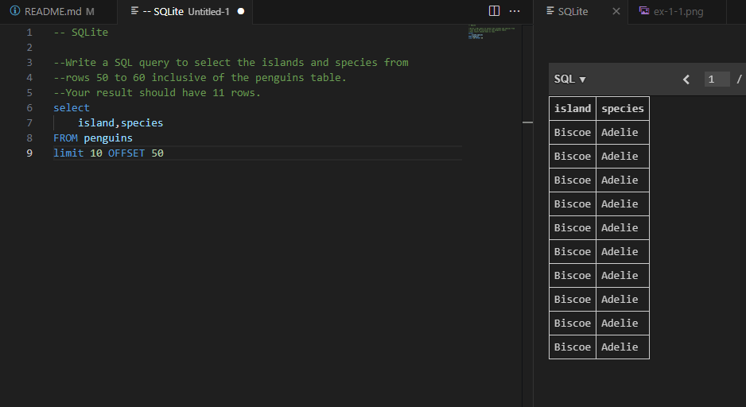

Modify your query to select distinct combinations of island and species from the same rows and compare the result to what you got in part 1.
```
select DISTINCT
    island,species 
FROM penguins 
```
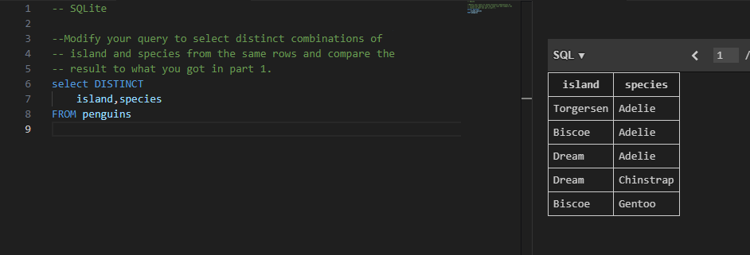


Zadanie 3
Write a query to select the body masses from penguins that are less than 3000.0 grams.
```
select body_mass_g from penguins WHERE body_mass_g<3000
```
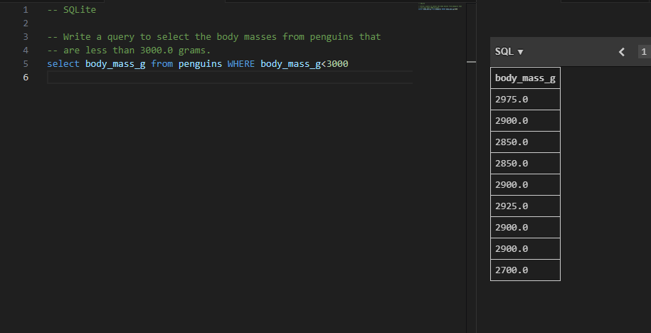

Write another query to select the species and sex of penguins that weight less than 3000.0 grams. This shows that the columns displayed and those used in filtering are independent of each other.
```
select species,sex from penguins WHERE body_mass_g<3000
```
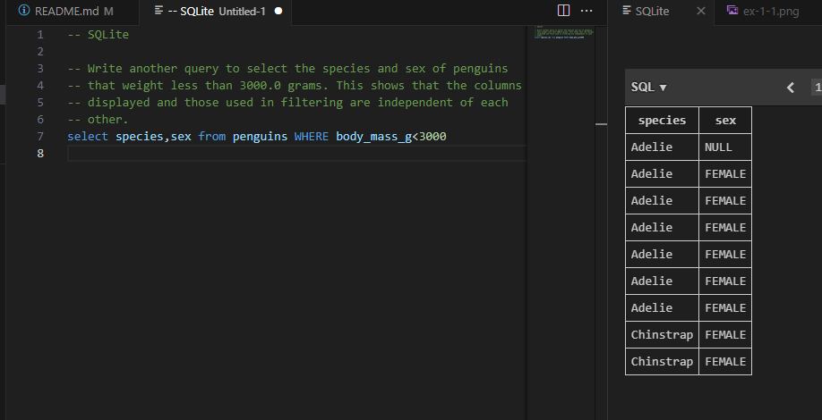

Zadanie 4
Use the not operator to select penguins that are not Gentoos.
```
select DISTINCT species from penguins WHERE species != 'Gentoo'
```
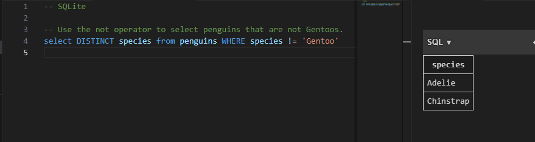

SQL's or is an inclusive or: it succeeds if either or both conditions are true. SQL does not provide a specific operator for exclusive or, which is true if either but not both conditions are true, but the same effect can be achieved using and, or, and not. Write a query to select penguins that are female or on Torgersen Island but not both.
```
select sex, island from penguins 
WHERE (sex = 'FEMALE' AND island != 'Torgersen')
   OR (island = 'Torgersen' AND sex != 'FEMALE');
```
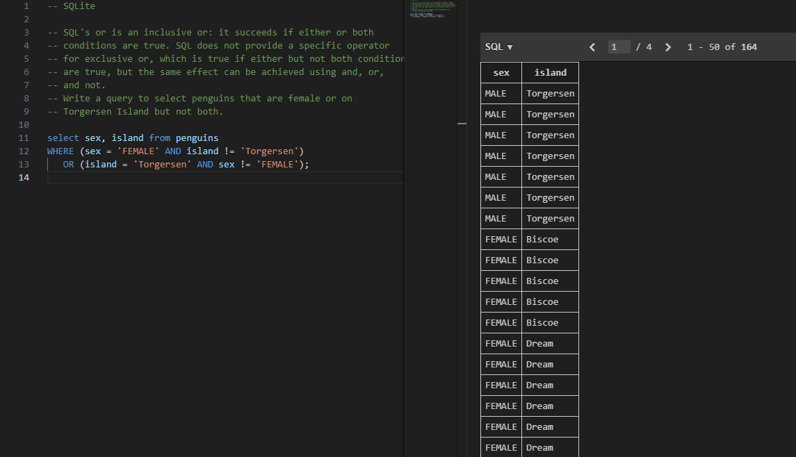


Zadanie 5
A column called what_where that has the species and island of each penguin separated by a single space.
```
SELECT species|| ' ' || island AS what_where from penguins
```
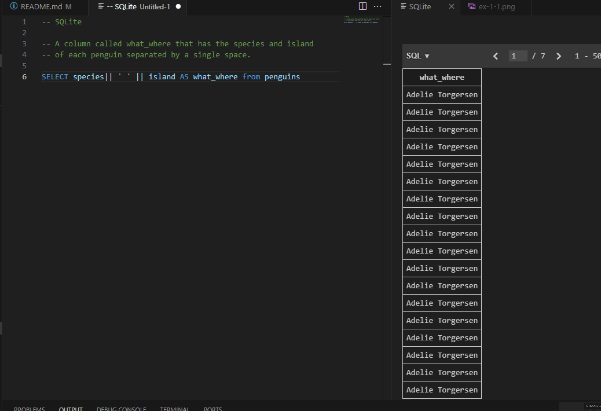

A column called bill_ratio that has the ratio of bill length to bill depth.
```
SELECT bill_length_mm/bill_depth_mm AS bill_ratio from penguins
```
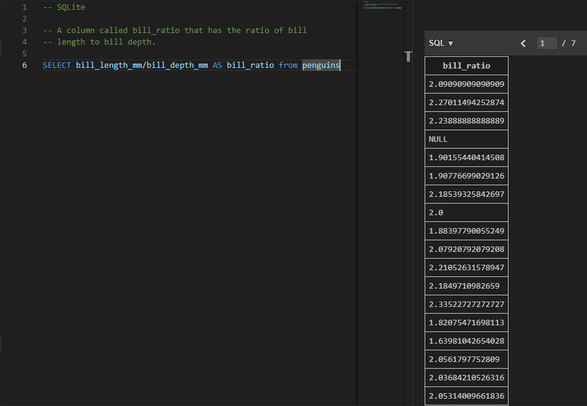

Zadanie 6
Write a query to find penguins whose body mass is known but whose sex is not.
```
SELECT body_mass_g,sex  from penguins 
where (sex is null) and (body_mass_g is not null)
```
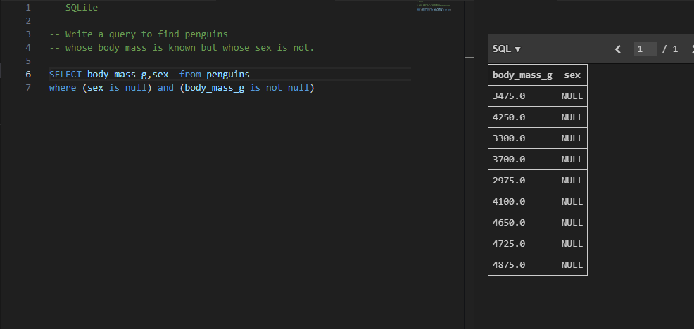


Write another query to find penguins whose sex is known but whose body mass is not.
```
SELECT body_mass_g,sex  from penguins 
where (sex is not null) and (body_mass_g is null)
```
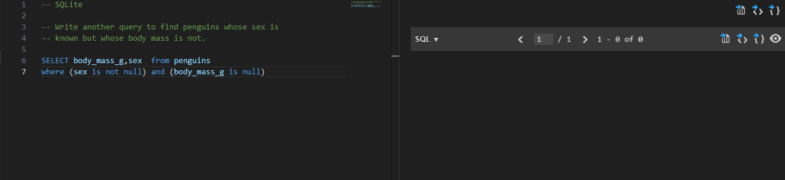

Zadanie 7
What is the average body mass of penguins that weight more than 3000.0 grams?

```
SELECT AVG(body_mass_g) AS average_mass
FROM penguins
WHERE body_mass_g > 3000.0;
```
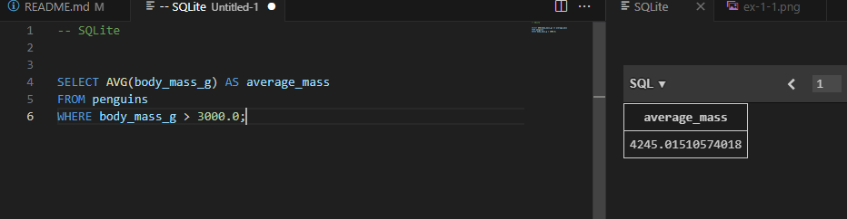

Zadanie 8
Write a query that shows each distinct body mass in the penguin dataset and the number of penguins that weigh that much.
```
SELECT DISTINCT
 body_mass_g, count(body_mass_g) as number_of_penguins
FROM penguins
group by body_mass_g
```
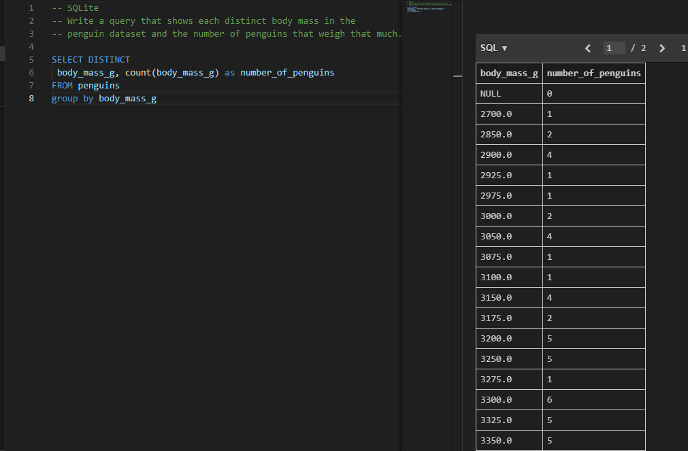

Zadanie 9
Stwórz klasy Vehicle i Car z polami nazwa, rok_produkcji i przebieg oraz metodami is_old() i is_long_mileage(). Stwórz po jednym obiekcie dla każdej z klas oraz trzeci obiekt, gdzie klasa Car dziedziczy z klasy Vehicle. Dla każdego z obiektów wywołaj obie metody, co najmniej raz użyj dekoratora @property w każdym z trzech przypadków.
<a href="skrypt9-25087.py">skrypt9-25087.py</a>

Zadanie 10
Napisz program, który korzystająć z metody chr() wygeneruje łańcuch znakowy z alfabetem, czyli 'abc....xyz'. Do pliku alfabet1-numeralbumu.txt zapisz wygenerowany łańcuch znakowy, a do pliku alfabet2-numeralbumu.txt zapisz litery z ww. łańcucha znakowego, tylko że każda litera ma się znaleźć w osobnej linii w pliku.
Hint: oprócz funkcji write() skorzystaj również z menadżera kontekstu with, żeby nie zapomnieć o zamknięciu pliku.
<a href="skrypt10-25087.py">skrypt10-25087.py</a>

Zadanie 11
Odwrócić sentencję podaną przez użytkownika.
<a href="skrypt11-25087.py">skrypt11-25087.py</a>

Zadanie 12
Zamienić wszystkie litery o na 0, e na 3, i na 1, a na 4 w podanej przez użytkownika sentencji.
<a href="skrypt12-25087.py">skrypt12-25087.py</a>

Zadanie 13
Używając pętli wyświetl liczby w przedziale od 1 do 50 oprócz liczb podzielnych przez 3.
<a href="skrypt13-25087.py">skrypt13-25087.py</a>

Zadanie 14
Używając pętli wyświetl liczby w przedziale od 1 do 100 podzielne przez 3 i 4 oraz podaj ich liczbę.
<a href="skrypt14-25087.py">skrypt14-25087.py</a>

Zadanie 15
Używając pętli dodawaj do wcześniej zadeklarowanej tabeli liczby z przedziału od 1 do 100, które są podzielne przez 3 lub podzielne przez 5.
<a href="skrypt15-25087.py">skrypt15-25087.py</a>

Zadanie 16
Napisz prostą funkcję o nazwie potega(), przyjmującą jeden argument, podnoszącą podaną liczbę do trzeciej potęgi.
<a href="skrypt16-25087.py">skrypt16-25087.py</a>

Zadanie 17
Stwórz klasę o nazwie Dog, która będzie posiadała zmienne takie jak: name, age, coat_color. Dodatkowo klasa posiada funkcje sound(), po wywołaniu której wypisywany jest tekst: {name} is barking! Stworzyć 3 obiekty klasy Dog.
<a href="skrypt17-25087.py">skrypt17-25087.py</a>

Zadanie 18
Stworzyć plik funkcje.py, w którym należy zaimplementować funkcję: dodawanie, odejmowanie, dzielenie, mnożenie oraz modulo. W pliku main.py zaimportować plik funkcje.py i wykorzystać zaimportowane funkcje na przykładowych wartościach.
<a href="skrypt18-25087.py">skrypt18-25087.py</a>

Zadanie 19
Sprawdź czy wyraz bądź zdanie podane przez użytkownika jest palindromem.
<a href="skrypt19-25087.py">skrypt19-25087.py</a>

Zadanie 20
Prosta gra, program generuje losową liczbę od 1 do 100, użytkownik ma odgadnąć liczbę, jeżeli nie trafi ma zostać wyświetlona podpowiedź czy za duża czy za mała liczba.
<a href="skrypt20-25087.py">skrypt20-25087.py</a>

Zadanie 21
Dziedziczenie klas. Klasa Animal ma zawierać atrybuty takie jak name, age, sex oraz metodę sound(). Klasy Dog, Cat oraz Fox dziedziczą po klasie Animal oraz nadpisują funkcje sound() odpowiednimi dźwiękami, dodatkowo klasy Dog oraz Cat posiadają atrybut breed.
<a href="skrypt21-25087.py">skrypt21-25087.py</a>

Zadanie 22
Należy wykorzystać plik wordlist_10000.txt i stworzyć funkcję wyszukującą najdłuższy wyraz w tym pliku oraz drugą funkcję, która wyszuka wyrazy o długości 10.
<a href="skrypt22-25087.py">skrypt22-25087.py</a>

Zadanie 23
Za pomocą pętli stworzyć 1000 losowych 6 znakowych wyrazów [A-Z][a-z][0-9] i zapisać je do pliku passwords.txt.
<a href="skrypt23-25087.py">skrypt23-25087.py</a>

Zadanie 24
Napisać funkcję tworzącą plik pc.csv. Pierwszy wiersz ma zawierać nazwy kolumn: pc_name, ip. Nazwy komputerów mają zaczynać się literą P oraz 4 oktetem adresu ip. Adresy zaczynają się od 172.30.2.1 do 172.30.2.100. Plik csv ma być rozdzielany przecinkami.
<a href="skrypt24-25087.py">skrypt24-25087.py</a>

Zadanie 25
Za pomocą pakietu do web-scrappingu, np.beautifulsoup lub jsoup, zapisać do tablicy wszystkie hiperłącza występujące na wybranej przez siebie stronie.
<a href="skrypt25-25087.py">skrypt25-25087.py</a>

Zadanie 26
Za pomocą webscrappera pobrać wszystkie oferty domów z podanego linku(https://www.otodom.pl/pl/wyniki/sprzedaz/mieszkanie/pomorskie/gdynia/gdynia/gdynia?priceMax=600000&viewType=listing), każda oferta ma być obiektem klasy Home, który posiada atrybuty takie jak header_name, price, price_for_m2. Wszystkie obiekty zapisać do słownika oraz do pliku home.csv.
<a href="skrypt26-25087.py">skrypt26-25087.py</a>
